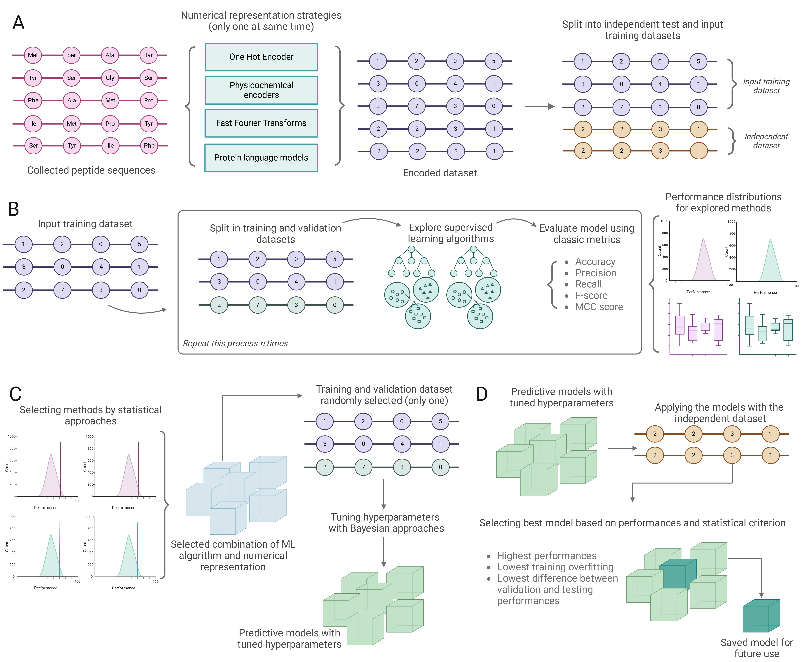

# Protein language models and machine learning facilitate the identification of antimicrobial peptides.

This repository contains the source code and relevant information for the implementations and use cases presented in the work: <br>
David Medina-Ortiz<sup>1,2*</sup>, Seba Contreras<sup>3*</sup>, Diego Fernández<sup>1</sup>, Nicole Soto-García<sup>1</sup>, Iván Moya<sup>1,4</sup>, and Álvaro Olivera-Nappa<sup>2</sup>.<br>

Protein language models and machine learning facilitate the identification of antimicrobial peptides. <br>

https://doi.org/XXXX<br>

<sup>*1*</sup><sub>Departamento de Ingeniería en Computación, Universidad de Magallanes, Av. Pdte. Manuel Bulnes 01855, 6210427, Punta Arenas, Chile.</sub> <br>
<sup>*2*</sup><sub>Centre for Biotechnology and Bioengineering, CeBiB, Universidad de Chile, Avenida Beauchef 851, 8320000, Santiago, Chile.</sub> <br>
<sup>*3*</sup><sub>Max Planck Institute for Dynamics and Self-Organization, Am Fa\ss berg 17, 37077 Göttingen, Germany.</sub> <br>
<sup>*4*</sup><sub>Departamento de Ingeniería Química, Universidad de Magallanes, Av. Pdte. Manuel Bulnes 01855, 6210427, Punta Arenas, Chile.</sub> <br>
<sup>*\**</sup><sub>Corresponding author</sub> <br>

---
## Table of Contents
- [A summary of the proposed work](#summary)
- [Requirements and instalation](#requirements)
- [Raw data and preprocessing](#data)
- [Numerical representation strategies](#numerical)
- [Training, tuning hyperparameters, and load models](#training)
- [Implemented pipeline](#pipeline)
- [Generative approaches](#generative)
- [References](#references)
---

<a name="summary"></a>

# Protein language models and machine learning facilitate the identification of antimicrobial peptides.

Peptides are bioactive molecules whose functional versatility in living organisms has successfully found applications in diverse industrial fields. 
In recent years, the amount of data describing peptide sequences and function collected in open repositories has substantially increased, allowing the application of more complex computational models to study the relations between peptide composition and function.
This work introduces sequence-based classification models for detecting peptides' functional biological activities, focusing on accelerating the discovery and *de novo* design of potential antimicrobial peptides (AMPs). 
A novel sequence-based pipeline was developed to train binary classification models, integrating protein language models and machine learning algorithms. This pipeline produced 21 models targeting antimicrobial, antiviral, and antibacterial activities, achieving an average precision exceeding 83%. Benchmark analyses revealed that our models outperformed existing methods for AMPs and delivered comparable results for other biological activities. Utilizing the Peptide Atlas, we discovered over 300,000 potential AMPs and demonstrated an integrative approach with generative learning to aid in the *de novo* design, resulting in over 500 novel AMPs. 
The combination of our methodology, robust models, and generative design strategy highlights a significant advancement in peptide-based drug discovery and represents a pivotal tool for therapeutic applications.

<a name="requirements"></a>
    <h2>
        Requirements and Install process
    </h2>

The requirements are summarized in the [environment.yml](environment.yml) file. Some requirements are summarized below:

- Python version 3.9+
- bio-embeddings [1]
- scikit-learn
- xgboost

Once this repository is cloned, please run the following command:

```
    conda env create -f environment.yml
```
<a name="data"> </a>
    <h2>
        Raw data and collection process
    </h2>

- All data was collected from the [Peptipedia v2.0 database](https://app.peptipedia.cl/)
- The raw data are also available on [Google Drive](https://drive.google.com/drive/folders/1IO_mL6Jt7vGQZ6aE7lK6crQFiLzZ62Cf?usp=sharing)
- Also, the raw data is available on the folder [raw_data](raw_data)
- With the raw data, you can create a binary classification models. First, create the pivoted dataset executing the following script:

```
    python src/preprocessing_data/create_pivoted_data.py path_to_raw_data path_to_export
```

- The script will generate a *.csv file with all sequences and all activities in a binarized format.

- With the pivoted dataset, a binary classification model can be create using the jupyter notebook example: [notebooks_examples/creating_binary_dataset.ipynb](notebooks_examples/creating_binary_dataset.ipynb). Please, select the positive activity and the generate the binary dataset.

- With the binary dataset generated, the redundancy homology need to be removed. Please, run the script:

```
    python src/preprocessing_data/remove_redundancy.py binary_dataset path_export benchmark_ratio name_col_with_activity redundacy_positive redundancy_negative
```

The script works with the input binary dataset and first split the dataset into positive and negative examples. Then, for each dataset, the CD-Hit tool is applied to remove redundancy using the given proportions for positive and negative examples. Then, undersampling is applied and the division between training and testing is addressed using the benchmark_ration. Finally, two datasets are generated.

<a name="numerical"> </a>
    <h2>
        Numerical representation strategies
    </h2>

This work explores four numerical representation strategies to encode the peptide sequences for developing sequence-based classification models. The strategies are:

- One Hot encoding
- Physicochemical properties [2]
- FFT-based encoders [3]
- Embedding through pretrained models [1]

A numerical representation module was implemented to apply the strategies and code the peptide sequences:

- See the module [src/numerical_representation_strategy](src/numerical_representation_strategy) for the source code
- See the jupyter notebool [notebooks_examples/encoding_peptide_sequences.ipynb](notebooks_examples/encoding_peptide_sequences.ipynb) for an example.

<a name="training"> </a>

<h2>
    Training and tuning hyperparameters
</h2>

With the dataset coded, a binary classification model could be trained using the modules available in [src/training_models](src/training_models). This module facilitates:

- Training classification models, selecting *k*-fold cross-validation and applying different metrics to evaluate the performances.
- Apply tuning-hyperparameters through Bayesian approaches using the Optuna framework [4].

Examples of how to apply the implemented module are available as jupyter notebook examples, please see:

- Training a classification model: [notebooks_examples/training_class_model.ipynb](notebooks_examples/training_class_model.ipynb)
- Tuning hyperparameters: [notebooks_examples/tuning_hyperparams.ipynb](notebooks_examples/tuning_hyperparams.ipynb)
- Load and use a trained model: [notebooks_examples/load_model.ipynb](notebooks_examples/load_model.ipynb)

<a name="pipeline"></a>

<h2>
    Implemented pipeline
</h2>

The implemented pipeline is represented in the following figure:



**Proposed methodology to generate and evaluate predictive models.**  **A.** Numerical representation of sequence datasets. Here, we explore different encoding strategies, including classic methods such as One Hot encoder, physicochemical property-based encoders, and embedding based on pre-trained models. All different methods are applied individually. Once the input dataset is encoded, it is randomly split in a 90:10 ratio, using the first part to develop models and the second as a benchmark dataset. **B.** Using the model development dataset and all its possible numerical representations, we explore different 80:20 partitions to use for model training and validation. We explore and evaluate different models and hyperparameters using classic performance metrics. As this stage is repeated an arbitrary number of times, we obtain distributions of performance for each model.  **C.** Based on the distribution of performance, the best-performing combinations of algorithms and numerical representations were selected based on statistical criteria. These models undergo a hyperparameter optimization procedure based on Bayesian criteria. **D.** Finally, we evaluate the performance of the models generated (and other tools/methods used to compare) using the benchmark dataset and export the best strategy for future use.

<a name="generative"></a>

<h2>
    Generative approaches
</h2>

This work applied two VAE strategies to explore generative approaches for generating *de novo* potential antimicrobial peptides. First, we generate 100,000 novel peptide sequences using the previously collected antimicrobial peptide dataset and the model implemented by [5]. We analyze the resulting dataset to remove redundancy and exclude results already reported in  Peptipedia [6] and the Peptide Atlas[7]. 

The second strategy is based on the architecture and methods proposed by [8]. Using the processed antimicrobial peptide dataset, a VAE model is trained by applying the architecture proposed in [8]. Then, 100,000 novel peptide sequences are generated using the trained models and the antimicrobial peptide dataset. The same filters were applied to discard redundancy and coincidence with Peptipedia and Peptide Atlas databases.

Once the novel peptide sequences are generated, we apply the models and encoding strategies developed in this work to classify these unknown peptide sequences. The stages are (i) applying numerical representation for each classification model, and (ii) predicting the novel sequences using the antimicrobial classification model and the different subtypes of classification models, like antiviral, antibacterial, and anuran defence. All classification models use a threshold to generate the classification based on the probability predicted for each category type (has the activity or has not the activity) on each model. This work applies a threshold of 0.7 to reduce the probability of error in a classification. 

Finally, the classified peptides are explored based on moonlighting properties and compared with the reported antimicrobial peptides and the predictions of novel potential antimicrobial peptides detected from the Peptide Atlas database.

<a name="references"> </a>
    <h2>
        References
    </h2>

- [1] Dallago, C., Schütze, K., Heinzinger, M., Olenyi, T., Littmann, M., Lu, A. X., ... & Rost, B. (2021). Learned embeddings from deep learning to visualize and predict protein sets. Current Protocols, 1(5), e113.
- [2] Medina-Ortiz, D., Contreras, S., Amado-Hinojosa, J., Torres-Almonacid, J., Asenjo, J. A., Navarrete, M., & Olivera-Nappa, Á. (2022). Generalized property-based encoders and digital signal processing facilitate predictive tasks in protein engineering. Frontiers in Molecular Biosciences, 9, 898627.
- [3] Medina-Ortiz, D., Contreras, S., Amado-Hinojosa, J., Torres-Almonacid, J., Asenjo, J. A., Navarrete, M., & Olivera-Nappa, A. (2020). Combination of digital signal processing and assembled predictive models facilitates the rational design of proteins. arXiv preprint arXiv:2010.03516.
- [4] Akiba, T., Sano, S., Yanase, T., Ohta, T., & Koyama, M. (2019, July). Optuna: A next-generation hyperparameter optimization framework. In Proceedings of the 25th ACM SIGKDD international conference on knowledge discovery & data mining (pp. 2623-2631).
- [5] Greener, J. G., Moffat, L., & Jones, D. T. (2018). Design of metalloproteins and novel protein folds using variational autoencoders. Scientific reports, 8(1), 16189.
- [6] Quiroz, C., Saavedra, Y. B., Armijo-Galdames, B., Amado-Hinojosa, J., Olivera-Nappa, Á., Sanchez-Daza, A., & Medina-Ortiz, D. (2021). Peptipedia: a user-friendly web application and a comprehensive database for peptide research supported by machine learning approach. Database, 2021, baab055.
- [7] Deutsch, E. W., Lam, H., & Aebersold, R. (2008). PeptideAtlas: a resource for target selection for emerging targeted proteomics workflows. EMBO reports, 9(5), 429-434.
- [8] Hawkins-Hooker, A., Depardieu, F., Baur, S., Couairon, G., Chen, A., & Bikard, D. (2021). Generating functional protein variants with variational autoencoders. PLoS computational biology, 17(2), e1008736.